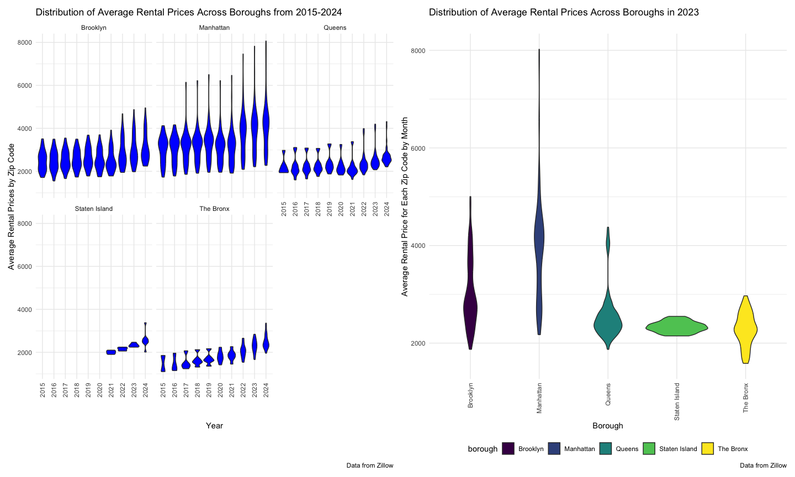

p8105_hw3_nec2159
================
Nicole Criscuolo
2025-10-02

## Problem 1

``` r
aisle_df =
  instacart |> 
  count(aisle) |> 
  arrange(desc(n))
```

The data set includes 1384617 observations and 15 variables. Key
variables include information about the product ordered (`product_name`,
`department`,`aisle`) and when the order was placed (`order_dow`,
`order_hour_of_day`), along with information about the customer’s order
habits (`reorder`, `order_number`, `days_since_prior_order`). The table
gives this information pertaining to each item ordered. In other words,
it lists out all the items that were ordered each time they were
ordered. The other variables then tell us about the order each item
belonged to (each time it was ordered) and other information as
described above.

There are 134 aisles. The top 5 aisles where most items are ordered from
are: fresh vegetables, fresh fruits, packaged vegetables fruits, yogurt,
packaged cheese.

``` r
items_ordered_plot = 
aisle_df |>
  filter(n > 10000, n < 160000) |> 
  mutate(aisle = forcats::fct_reorder(aisle, n)) |> 
  ggplot(aes(x = n, y = aisle)) +
  geom_col(aes(fill = "purple"), show.legend = FALSE) +
    labs (
    x = "Number of Items Ordered",
    y = "Aisle",
    title = "Number of Items Ordered from Each Aisle",
    caption = "Data from Instacart"
  ) 

print(items_ordered_plot)
```


This plot verifies what we found above, which is that the top 5 aisles
where most items are ordered from are fresh vegetables, fresh fruits,
packaged vegetables and fruits, yogurt, and packaged cheese. We can see
that the numbers of items ordered from the top 2 aisles, fresh
vegetables and fresh fruits, were significantly higher than the numbers
of items ordered from the rest of the aisles. Additionally, the bottom 2
aisles out of all the aisles where the number of items ordered exceeds
10000 are butter and oils and vinegars.

``` r
  instacart |> 
  filter(aisle %in% c("baking ingredients", "dog food care", "packaged vegetables fruits")) |> 
  count(product_name, aisle) |> 
  arrange(desc(n)) |> 
  rename(times_ordered = n) |> 
  group_by(aisle) |> 
  filter(row_number() < 4) |> 
  knitr::kable()
```

| product_name | aisle | times_ordered |
|:---|:---|---:|
| Organic Baby Spinach | packaged vegetables fruits | 9784 |
| Organic Raspberries | packaged vegetables fruits | 5546 |
| Organic Blueberries | packaged vegetables fruits | 4966 |
| Light Brown Sugar | baking ingredients | 499 |
| Pure Baking Soda | baking ingredients | 387 |
| Cane Sugar | baking ingredients | 336 |
| Snack Sticks Chicken & Rice Recipe Dog Treats | dog food care | 30 |
| Organix Chicken & Brown Rice Recipe | dog food care | 28 |
| Small Dog Biscuits | dog food care | 26 |

The three most popular items in the packaged vegetables and fruits aisle
were ordered a significantly larger number of times than the three most
popular items in the baking ingredients and dog food care aisles. This
makes sense being that we already know the packaged vegetables and
fruits aisle is one of the top 5 most popular aisles. Similarly, the
three most popular items in the baking ingredients aisle were ordered a
significantly larger number of times than the three most popular items
in the dog food care aisle. Again this makes sense as our previous plot
included baking ingredients (signifying it had over 10000 items ordered)
whereas it did not include dog food care (meaning it had less than 10000
items ordered.)

``` r
  instacart |> 
  filter(product_name %in% c("Pink Lady Apples", "Coffee Ice Cream")) |> 
  group_by(order_dow) |> 
  summarize(
    mean_hour_ordered = mean(order_hour_of_day)
  ) |> 
  knitr::kable()
```

| order_dow | mean_hour_ordered |
|----------:|------------------:|
|         0 |          13.60000 |
|         1 |          12.17391 |
|         2 |          12.83824 |
|         3 |          14.68519 |
|         4 |          13.17308 |
|         5 |          12.64286 |
|         6 |          13.25000 |

Pink lady apples and coffee ice cream appear to be ordered the most on
average during hours 12-14 each day. They are ordered the latest on
average on day 3 and the earliest on average on day 1.

## Problem 2

``` r
zip_df =
  read_csv("data/Zip Codes.csv") |> 
  janitor::clean_names() |> 
  select(-state_fips, -file_date, -county) |> 
  distinct(zip_code, .keep_all = TRUE)

zori_df =
  read_csv("data/Zip_zori_NYC.csv") |> 
  pivot_longer(
    cols = "2015-01-31":"2024-08-31",
    names_to = "date",
    values_to = "zori"
  ) |> 
  janitor::clean_names() |> 
  rename(zip_code = region_name) |> 
  select(-region_type, -state_name, -state, -city, -metro) |> 
  separate(date, into = c("year", "month", "day"), sep = "-") |> 
  mutate(borough = case_match(
    county_name,
      "Bronx County" ~ "The Bronx",
      "Kings County" ~ "Brooklyn",
      "New York County" ~ "Manhattan",
      "Queens County" ~ "Queens",
      "Richmond County" ~ "Staten Island"
    )
  ) |> 
  drop_na(zori)

zip_zori_df =
  left_join(zori_df, zip_df) |> 
  arrange(zip_code)
```

There are 48 ZIP codes observed 116 times. There are 26 ZIP codes
observed fewer than 10 times. The reason why some ZIP codes are observed
rarely and other are observed in each month is most likely is due to how
Zillow collected the data or the availability of rental properties in
each zip code. It is possible Zillow may have only started collecting
data in certain zip codes after a certain point in time or certain zip
codes don’t have many rental properties to collect data on each month.

``` r
avg_price_df =
zip_zori_df |> 
  group_by(borough, year) |> 
  summarize(
    avg_rental_price = mean(zori, na.rm = TRUE)
  ) |> 
  knitr::kable()
```

    ## `summarise()` has grouped output by 'borough'. You can override using the
    ## `.groups` argument.

``` r
print(avg_price_df)
```

    ## 
    ## 
    ## |borough       |year | avg_rental_price|
    ## |:-------------|:----|----------------:|
    ## |Brooklyn      |2015 |         2492.928|
    ## |Brooklyn      |2016 |         2520.357|
    ## |Brooklyn      |2017 |         2545.828|
    ## |Brooklyn      |2018 |         2547.291|
    ## |Brooklyn      |2019 |         2630.504|
    ## |Brooklyn      |2020 |         2555.051|
    ## |Brooklyn      |2021 |         2549.890|
    ## |Brooklyn      |2022 |         2868.199|
    ## |Brooklyn      |2023 |         3015.184|
    ## |Brooklyn      |2024 |         3126.803|
    ## |Manhattan     |2015 |         3022.042|
    ## |Manhattan     |2016 |         3038.818|
    ## |Manhattan     |2017 |         3133.848|
    ## |Manhattan     |2018 |         3183.703|
    ## |Manhattan     |2019 |         3310.408|
    ## |Manhattan     |2020 |         3106.517|
    ## |Manhattan     |2021 |         3136.632|
    ## |Manhattan     |2022 |         3778.375|
    ## |Manhattan     |2023 |         3932.610|
    ## |Manhattan     |2024 |         4078.440|
    ## |Queens        |2015 |         2214.707|
    ## |Queens        |2016 |         2271.955|
    ## |Queens        |2017 |         2263.303|
    ## |Queens        |2018 |         2291.918|
    ## |Queens        |2019 |         2387.816|
    ## |Queens        |2020 |         2315.632|
    ## |Queens        |2021 |         2210.787|
    ## |Queens        |2022 |         2406.038|
    ## |Queens        |2023 |         2561.615|
    ## |Queens        |2024 |         2694.022|
    ## |Staten Island |2020 |         1977.608|
    ## |Staten Island |2021 |         2045.430|
    ## |Staten Island |2022 |         2147.436|
    ## |Staten Island |2023 |         2332.934|
    ## |Staten Island |2024 |         2536.442|
    ## |The Bronx     |2015 |         1759.595|
    ## |The Bronx     |2016 |         1520.194|
    ## |The Bronx     |2017 |         1543.599|
    ## |The Bronx     |2018 |         1639.430|
    ## |The Bronx     |2019 |         1705.589|
    ## |The Bronx     |2020 |         1811.443|
    ## |The Bronx     |2021 |         1857.777|
    ## |The Bronx     |2022 |         2054.267|
    ## |The Bronx     |2023 |         2285.459|
    ## |The Bronx     |2024 |         2496.896|

Each of the boroughs saw an increase in the average rental price from
2015 to 2024. Staten Island is the only borough without data from before
2020. However, Staten Island’s average rental price increased from 2020
to 2024.

``` r
prices_by_year_plot =
zip_zori_df |> 
  group_by(year, zip_code, borough) |> 
  ggplot(aes(x = year, y = zori)) +
  geom_violin(fill = "blue") +
  labs(
    x = "Borough",
    y = "Rental Prices by Zip Code",
    title = "Rental Prices Across Boroughs",
    caption = "Data from Zillow"
  ) +
  facet_wrap(borough ~ .) +
  theme(axis.text.x = element_text(angle = 90, hjust = 1, vjust = .5))
```

``` r
avg_price_plot =
zip_zori_df |> 
  filter(year == 2023) |> 
  group_by(month, zip_code, borough) |> 
  summarize(
    avg_rental_price = mean(zori, na.rm = TRUE)
  ) |> 
  ggplot(aes(x = borough, y = avg_rental_price)) +
  geom_violin(aes(fill = borough)) +
  labs(
    x = "Borough",
    y = "Average Rental Price for Each Zip Code",
    title = "Distribution of Average Rental Prices Across Boroughs in 2023",
    caption = "Data from Zillow"
  ) + 
  theme(axis.text.x = element_text(angle = 90, hjust = 1, vjust = .5))
```

    ## `summarise()` has grouped output by 'month', 'zip_code'. You can override using
    ## the `.groups` argument.

``` r
zori_plots = (prices_by_year_plot + avg_price_plot)
zori_plots
```



## Problem 3

``` r
demographic_df =
  read_csv("data/nhanes_covar.csv", skip = 4) |> 
  janitor::clean_names()
```

    ## Rows: 250 Columns: 5
    ## ── Column specification ────────────────────────────────────────────────────────
    ## Delimiter: ","
    ## dbl (5): SEQN, sex, age, BMI, education
    ## 
    ## ℹ Use `spec()` to retrieve the full column specification for this data.
    ## ℹ Specify the column types or set `show_col_types = FALSE` to quiet this message.

``` r
accelerometer_df =
  read_csv("data/nhanes_accel.csv") |> 
  janitor::clean_names() |> 
  pivot_longer(
    cols = "min1":"min1440",
    names_to = "min",
    values_to = "mims",
    names_prefix = "min"
  ) |> 
  mutate(min = as.numeric(min))
```

    ## Rows: 250 Columns: 1441
    ## ── Column specification ────────────────────────────────────────────────────────
    ## Delimiter: ","
    ## dbl (1441): SEQN, min1, min2, min3, min4, min5, min6, min7, min8, min9, min1...
    ## 
    ## ℹ Use `spec()` to retrieve the full column specification for this data.
    ## ℹ Specify the column types or set `show_col_types = FALSE` to quiet this message.

``` r
full_df =
  left_join(accelerometer_df, demographic_df) |> 
  filter(age > 20) |> 
  drop_na(sex, age, bmi, education) |> 
  mutate(sex = case_match(
           sex,
         1 ~ "male",
         2 ~ "female"),
         education = case_match(
           education,
           1 ~ "Less than HS",
           2 ~ "HS Equivalent",
           3 ~ "More than HS"),
         education = fct_relevel(education, c("Less than HS", "HS Equivalent", "More than HS")))
```

    ## Joining with `by = join_by(seqn)`

``` r
full_df |> 
  count(education, sex) |> 
  knitr::kable()
```

| education     | sex    |     n |
|:--------------|:-------|------:|
| Less than HS  | female | 40320 |
| Less than HS  | male   | 38880 |
| HS Equivalent | female | 33120 |
| HS Equivalent | male   | 50400 |
| More than HS  | female | 84960 |
| More than HS  | male   | 80640 |

``` r
full_df |> 
  ggplot(aes(x = education, y = age, group_by = education)) +
  geom_violin(aes(fill = sex)) +
  labs(
    x = "Education",
    y = "Age",
    title = "Age Distributions for Men and Women in Each Education Category",
    caption = "Data from NHANES Study"
  )
```


``` r
full_df |> 
  group_by(seqn, age, education, sex) |> 
  summarize(
    total_activity = sum(mims)
  ) |> 
  ggplot(aes(x = age, y = total_activity, color = sex)) +
  geom_point(size = 0.5) +
  geom_smooth(se = FALSE) +
  facet_grid(. ~ education) +
  labs(
    x = "Age",
    y = "Total Daily Activity",
    title = "Total Daily Activity by Age, Sex, and Education Level",
    caption = "Data from NHANES Study"
  )
```

    ## `summarise()` has grouped output by 'seqn', 'age', 'education'. You can
    ## override using the `.groups` argument.
    ## `geom_smooth()` using method = 'loess' and formula = 'y ~ x'


``` r
full_df |> 
  group_by(seqn, mims, education, sex) |> 
  ggplot(aes(x = min, y = mims, color = sex)) +
  geom_point() +
  geom_smooth(se = FALSE, color = "red") +
  facet_grid(sex ~ education) +
  scale_x_continuous(
    breaks = c(1, 360, 720, 1080, 1440),
    labels = c("0", "6", "12", "18", "24")
  )+
  labs(
    x = "Hour",
    y = "Movement Summary Unit",
    title = "24 Hour Activity by Sex and Education Level",
    caption = "Data from NHANES Study"
  )
```

    ## `geom_smooth()` using method = 'gam' and formula = 'y ~ s(x, bs = "cs")'


